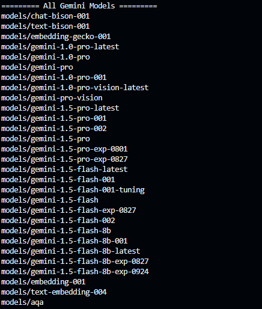
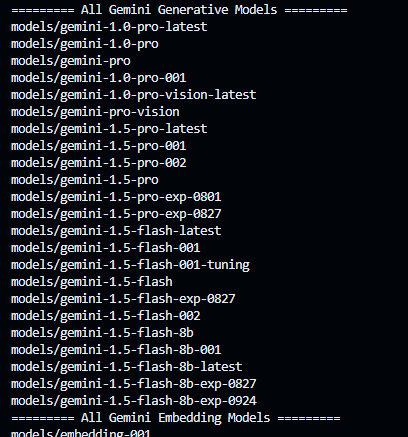
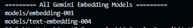

Google Gemini AI, formerly known as Bard, is a cutting-edge artificial intelligence model developed by Google. It represents a significant advancement in generative AI, designed to facilitate natural conversations and perform a variety of tasks across multiple data types. Here’s an overview of its key features and capabilities:

## **Overview of Google Gemini AI:**

- **Multimodal Capabilities**: Gemini is a family of large language models (LLMs) that can process and generate text, images, audio, video, and code. This allows it to understand and respond to complex queries involving various forms of input simultaneously.

- **Architecture**: Built on a transformer-based neural network architecture, Gemini was trained on diverse datasets encompassing multiple modalities. This enables it to perform sophisticated reasoning and integrate information from different sources seamlessly.

- **Versions**: The Gemini model comes in several variants:
  - **Gemini 1.0 Ultra**: The largest model for complex tasks.
  - **Gemini 1.5 Pro**: A balanced model for general performance.
  - **Gemini Nano**: Optimized for efficiency on mobile devices.

## **Key Features:**

- **Natural Language Processing (NLP)**: Gemini excels in understanding and generating human-like text responses, making it suitable for applications like chatbots and virtual assistants.

- **Image and Video Understanding**: It can analyze and interpret visual data, such as charts or handwritten notes, without needing external tools like optical character recognition .

- **Audio Processing**: Gemini supports speech recognition and audio translation tasks across numerous languages, enhancing its usability in various contexts[1][3].

- **Code Generation and Analysis**: The model can understand and generate code in popular programming languages, aiding developers with tasks like debugging or writing new code.

## **Gemini All Models:**

## **Gemini Generative Models:**

## **Gemini Embedding Models:**

## **Integration and Applications:**

Google has integrated Gemini into many of its products, including Google Search, YouTube, Gmail, and Android. This widespread deployment aims to enhance user experience by providing more intelligent responses and functionalities across platforms. Additionally, developers can access the Gemini API to build custom applications that leverage its capabilities.

## **Conclusion:**

Launched on December 6, 2023, Google Gemini AI marks a pivotal moment in AI development at Google. Its multimodal design and advanced reasoning capabilities position it as one of the most capable AI models available today, aimed at transforming how users interact with technology across various domains.
